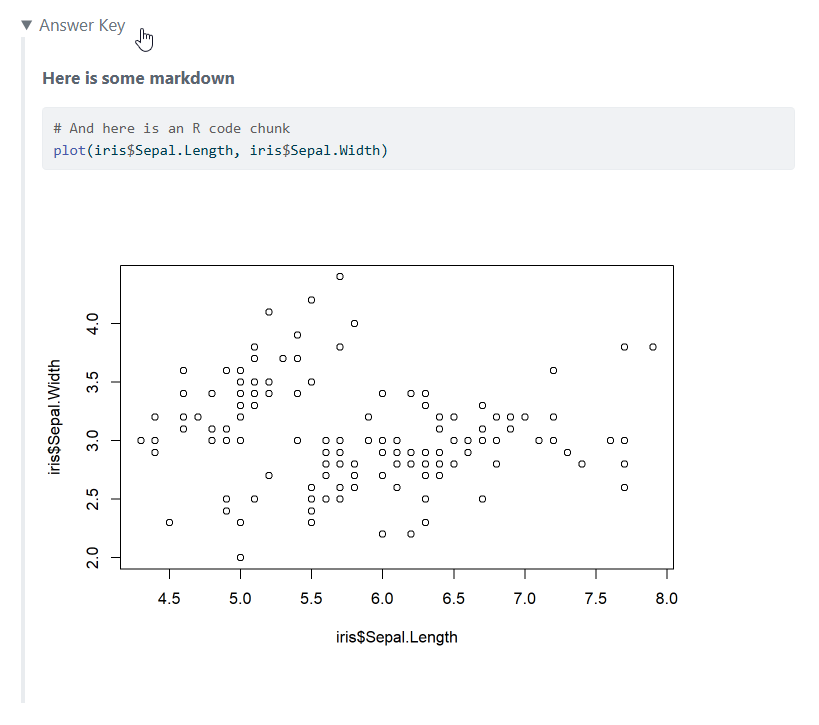

# Details Extension For Quarto

This extension can easily add interactive "details" blocks (which can be toggled between open and collapsed) to Quarto HTML documents. This can be useful for adding hints, answer keys, and supplemental information to documents. It is similar to "code folding" but for a more flexible range of contents.



## Installing

```bash
quarto add jmgirard/details
```

This will install the extension under the `_extensions` subdirectory.
If you're using version control, you will want to check in this directory.

## Using

### Simple text

``

### Customize summary

``

### Start open/uncollapsed

``

### Complex contents with start/stop

````md


**Here is some markdown**

```{r}
# And here is an R code chunk
plot(iris$Sepal.Length, iris$Sepal.Width)
```


````

## Example

Here is a demo for the details extension: [index.html](https://jmgirard.github.io/details).
